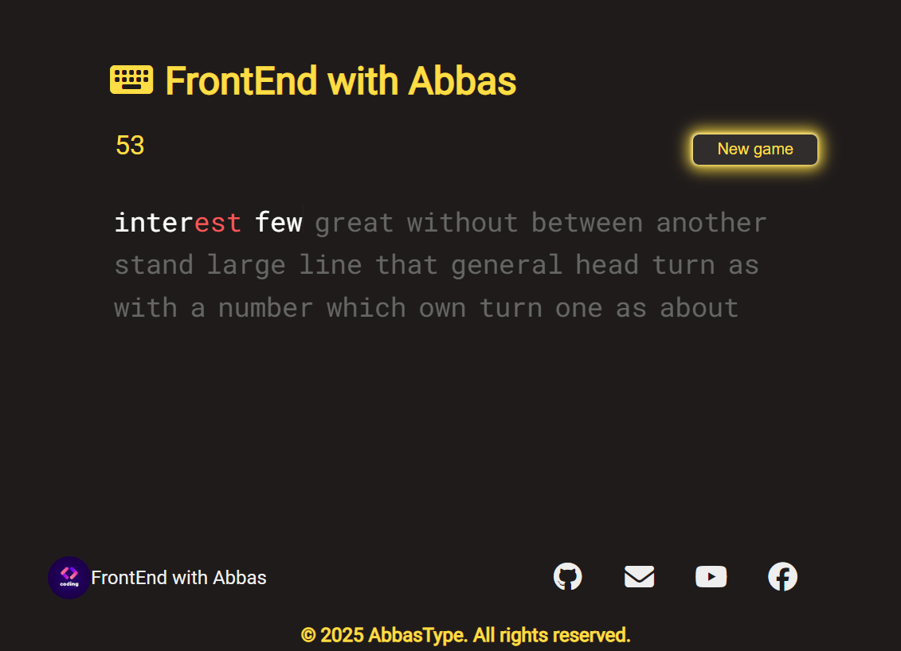

# ⌨️ Typing Speed Test App

A simple and interactive **Typing Speed Test** web application built using **HTML, CSS, and JavaScript**. This app lets users test their typing speed in real-time with instant feedback on **WPM (Words Per Minute)**, **accuracy**, and **errors**.

 <!-- Optional: Add your project screenshot -->

## 🚀 Live Demo
🔗 [View Live on GitHub Pages](https://abbas-devloper.github.io/Typing)

## 📌 Features
- 🔤 Real-time typing test with dynamic word generation  
- 📈 Calculates WPM (Words Per Minute) and accuracy  
- 🧠 Highlights correct and incorrect characters  
- ♻️ Reset and restart functionality  
- 📱 Fully responsive and mobile-friendly  

## 🛠️ Tech Stack
- **HTML5** – Markup  
- **CSS3** – Styling and layout  
- **JavaScript (Vanilla)** – Logic and interactivity  

## 🎯 How to Use
1. Start typing the displayed words.
2. Your speed and accuracy will be updated live.
3. Use the reset button to try again.

## 💡 Use Cases
- Practice typing speed and accuracy  
- Build keyboard muscle memory  
- Demonstrate frontend development skills  

## 🧑‍💻 Author
**Muhammad Abbas Soomro**  
- 🌐 [Portfolio](https://my-portfolio-dun-five-37.vercel.app/)  
- 💼 [GitHub](https://github.com/Abbas-Devloper)  
- 📹 [YouTube Channel](https://youtube.com/@Abbas-Devloper)

## 📄 License
This project is open-source and free to use under the [MIT License](LICENSE).

